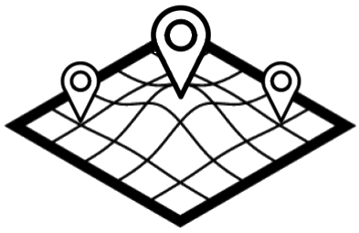

# SAVT-Dashboard
> [Google Summer of Code](https://developers.google.com/open-source/gsoc/) project for **Liquid Galaxy** [organization](https://github.com/LiquidGalaxyLAB).

Browser client side of Smart Agro Visualization Tool (*SAVT*) project.

SAVT is a web application that creates a friendly non-expert user experience to visualize smart agriculture data grouped in two types (sensors and drone images) and send them to a [Liquid Galaxy](https://github.com/LiquidGalaxy/liquid-galaxy/wiki).



## Getting started

### Installation

```shell
git clone git@github.com:calv00/SAVT-Dashboard.git
cd dashboardproject
sudo npm install
```

### Usage

```shell
npm start
```

## Developing

### Built With
- [Node](https://nodejs.org/)
- [Angular](https://angular.io/)
- [npm](https://www.npmjs.com/)

### Information
This app is configured to run on port 3001. To change the port, the file [bs-config.json](https://github.com/calv00/SAVT-Dashboard/blob/master/bs-config.json) has to be modified:
```
{
  "port": 3001,
  "server": {
    ...
    }
  },
  ...
}
```

#### Future work
| Feature                   | Status      |
| ------------------------- | ----------- |
| Deploy on public server   | Not planned |

## References

SAVT-Dashboard has been created thanks to the code of the projects:
- **navijo**'s [FlOYBD](https://github.com/navijo/FlOYBD)
- **zurfyx**'s [memories](https://github.com/zurfyx/memories)

Readme based on **wearehive**'s [project-guidelines](https://github.com/wearehive/project-guidelines)

### Google Summer of Code
GSOC info explained [here](https://github.com/calv00/SAVT-Dashboard/blob/master/docs/README.md).

## Issues
Feel free to open an [issue](https://github.com/calv00/SAVT-Dashboard/issues) of any error you find in the project. 

## Licensing

[MIT License](https://github.com/calv00/SAVT-Dashboard/blob/master/LICENSE)

Copyright (c) 2017 Javier Calvo García